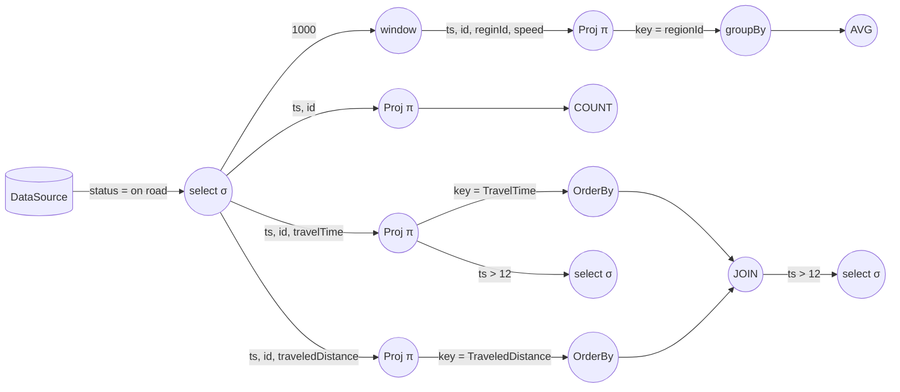
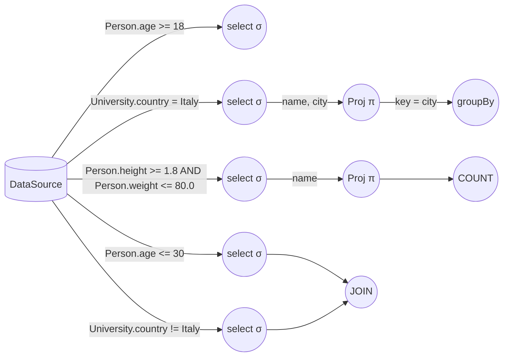

## Stream Processing DSL

Query di esempio:

```sql
SELECT ts, regionId, AVG(speed)
FROM stream(agent, 1000)
WHERE on_road_flag = true
GROUP BY regionId
```

```sql
SELECT ts, COUNT(*)
FROM stream(agent)
WHERE on_road_flag = true
```

```sql
SELECT ts, id, traveledTime as TraveledTimeTable
FROM stream(agent)
WHERE on_road_flag = true
ORDERED BY traveledTime DESC LIMIT 3
```

```sql
SELECT ts, id, traveledTime as TraveledDistanceTable
FROM stream(agent)
WHERE on_road_flag = true
ORDERED BY traveledDistance DESC LIMIT 3
```

```sql
SELECT TraveledTimeTable.id, TraveledTimeTable.ts, TraveledDistanceTable.id, TraveledDistanceTable.ts AS pippo
FROM stream(TraveledTimeTable)
JOIN stream(TraveledDistanceTable)
ON TraveledTimeTable.ts = TraveledDistanceTable.ts
```

```sql
SELECT *
FROM stream(pippo)
WHERE HOUR(ts) > 12
```

```sql
SELECT *
FROM stream(TraveledTimeTable)
WHERE HOUR(ts) > 12
```

Queste possono essere mappate sul seguente grafo di operatori:



facente riferimento a [questo dataset](https://www.nyc.gov/site/tlc/about/tlc-trip-record-data.page) (sono diversi TB di dati).


Altro esempio:

Date le seguenti tabelle:
```sql
CREATE TABLE Person (
	name String
	age Integer
	height Float
	weight Float
)
```

```sql
CREATE TABLE University (
	name String
	city String
	country String
)
```

e le seguenti query:

```sql
SELECT * 
FROM Person
WHERE age >= 18
```

```sql
SELECT name, city
FROM University
WHERE country = "Italy"
GROUP BY city
```

```sql
SELECT COUNT(name)
FROM Person
WHERE height >= 1.8 AND weight <= 80.0
```

```sql
SELECT * 
FROM Person JOIN University
WHERE Person.age <= 30 AND University.country != "Italy"
```

il grafo risultante è:



Idea di procedura:

* Si crea un behavior per ognuna delle seguenti operazioni:
	* Selezione: riceve in input una sequenza di tuple;
	* Proiezione: riceve in input una sequenza di tuple ed una sequenza di attributi, ed effettua la proiezione;
	* JOIN (se presente): riceve due o più sequenze di tuple e le unisce;
	* Operatore aggregato (se presente): riceve una lista di tuple ed effettua un'operazione su queste (e.g., COUNT: conta il numero di tuple);
	* GROUP BY/ORDER BY (se presenti): ricevono una sequenza di tuple e applicano una trasformazione su questa.

* Per ogni diversa condizione:
	* Si crea un attore di selezione S, che riceve in input le tuple che rispettano la condizione.
* Per ogni SELECT con argomento != *:
	* Si crea un attore di proiezione P, che riceve in input i nomi delle colonne che deve selezionare.
	* Se la SELECT contiene un operatore aggregato, P crea un attore C per l'operatore aggregato, che riceve in input tutte le tuple di P (idem se esistono statement del tipo groupBy, orderBy, ...).
* Per ogni JOIN, viene creato un attore J che è raggiungibile dagli attori di selezione delle SELECT presenti nella stessa query.
* Per ogni operatore aggregato (o per statement orderBy/groupBy) viene creato un attore con behavior corrispondente, raggiungibile da almeno un attore di selezione o proiezione, in base alla query.
