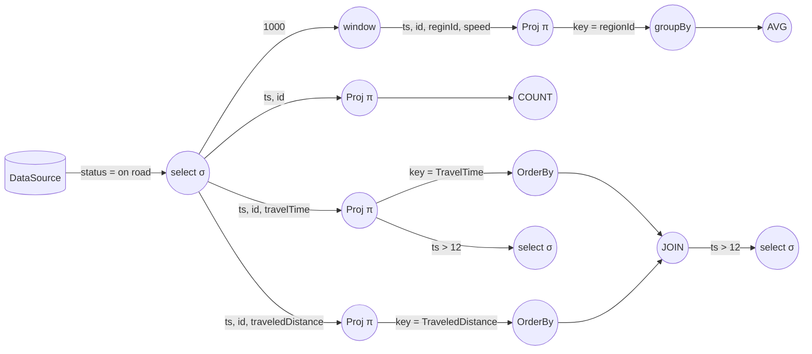

## Stream Processing DSL

Query di esempio:

```sql
SELECT ts, regionId, AVG(speed)
FROM stream(agent, 1000)
WHERE on_road_flag = true
GROUP BY regionId
```

```sql
SELECT ts, COUNT(*)
FROM stream(agent)
WHERE on_road_flag = true
```

```sql
SELECT ts, id, traveledTime as TraveledTimeTable
FROM stream(agent)
WHERE on_road_flag = true
ORDERED BY traveledTime DESC LIMIT 3
```

```sql
SELECT ts, id, traveledTime as TraveledDistanceTable
FROM stream(agent)
WHERE on_road_flag = true
ORDERED BY traveledDistance DESC LIMIT 3
```

```sql
SELECT TraveledTimeTable.id, TraveledTimeTable.ts, TraveledDistanceTable.id, TraveledDistanceTable.ts AS pippo
FROM stream(TraveledTimeTable)
JOIN stream(TraveledDistanceTable)
ON TraveledTimeTable.ts = TraveledDistanceTable.ts
```

```sql
SELECT *
FROM stream(pippo)
WHERE HOUR(ts) > 12
```

```sql
SELECT *
FROM stream(TraveledTimeTable)
WHERE HOUR(ts) > 12
```

Queste possono essere mappate sul seguente grafo di operatori:



facente riferimento a [questo dataset](https://www.nyc.gov/site/tlc/about/tlc-trip-record-data.page) (sono diversi TB di dati).
