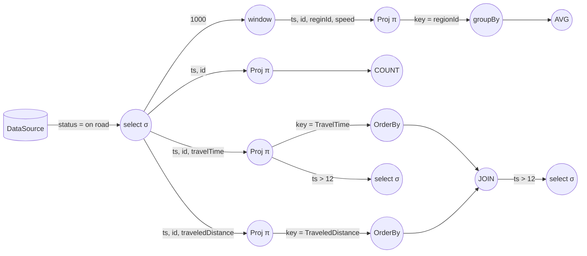
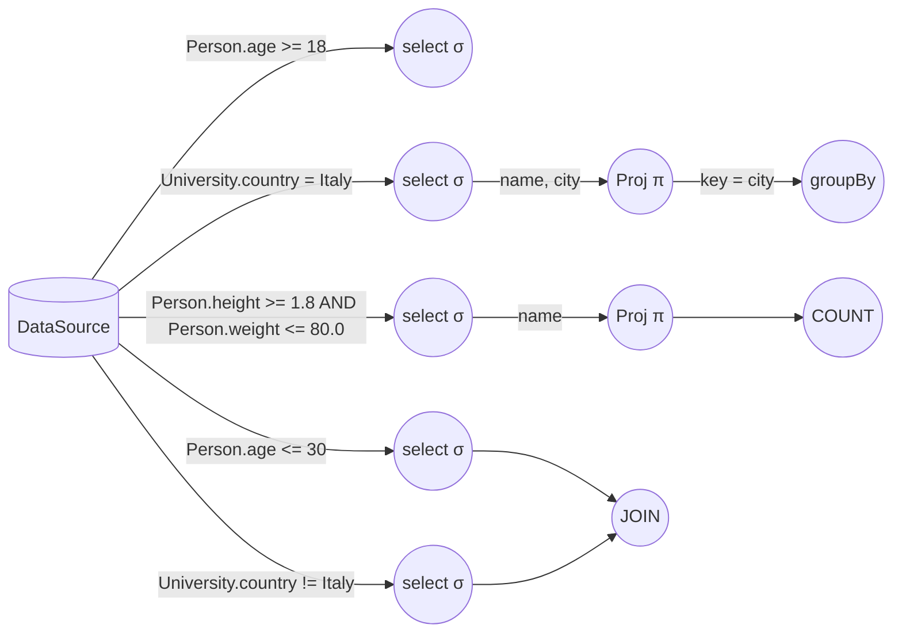

## Stream Processing DSL

Query di esempio:

```sql
SELECT ts, regionId, AVG(speed)
FROM stream(agent, 1000)
WHERE on_road_flag = true
GROUP BY regionId
```

```sql
SELECT ts, COUNT(*)
FROM stream(agent)
WHERE on_road_flag = true
```

```sql
SELECT ts, id, traveledTime as TraveledTimeTable
FROM stream(agent)
WHERE on_road_flag = true
ORDERED BY traveledTime DESC LIMIT 3
```

```sql
SELECT ts, id, traveledTime as TraveledDistanceTable
FROM stream(agent)
WHERE on_road_flag = true
ORDERED BY traveledDistance DESC LIMIT 3
```

```sql
SELECT TraveledTimeTable.id, TraveledTimeTable.ts, TraveledDistanceTable.id, TraveledDistanceTable.ts AS pippo
FROM stream(TraveledTimeTable)
JOIN stream(TraveledDistanceTable)
ON TraveledTimeTable.ts = TraveledDistanceTable.ts
```

```sql
SELECT *
FROM stream(pippo)
WHERE HOUR(ts) > 12
```

```sql
SELECT *
FROM stream(TraveledTimeTable)
WHERE HOUR(ts) > 12
```

Queste possono essere mappate sul seguente grafo di operatori:



facente riferimento a [questo dataset](https://www.nyc.gov/site/tlc/about/tlc-trip-record-data.page) (sono diversi TB di dati).


Altro esempio:

Date le seguenti tabelle:
```sql
CREATE TABLE Person (
	name String
	age Integer
	height Float
	weight Float
)
```

```sql
CREATE TABLE University (
	name String
	city String
	country String
)
```

e le seguenti query:

```sql
SELECT * 
FROM Person
WHERE age >= 18
```

```sql
SELECT name, city
FROM University
WHERE country = "Italy"
GROUP BY city
```

```sql
SELECT COUNT(name)
FROM Person
WHERE height >= 1.8 AND weight <= 80.0
```

```sql
SELECT * 
FROM Person JOIN University
WHERE Person.age <= 30 AND University.country != "Italy"
```

il grafo risultante è:



## Creazione topologia

### Creazione attori
Date tutte le query:
1. $\forall$ diversa condizione in tutte le query:
	* `create_actor(Select)`
2. $\forall$ diversa condizione in tutte le query che effettuano join:
	* `create_actor(Join)` 
3. $\forall$ query q:
	* Se `query.cols != AllColumns` -> `create_actor(Proj)`;
	* Se `query.groupBy != NULL` -> `create_actor(GroupBy)`;
	* Se `query.orderBy != NULL` -> `create_actor(OrderBy)`;
	* Se `query.aggOp != NULL` -> `create_actor(AggOp)`.

Nel caso di attori di Select e Join, ogni attore viene associato alla condizione per la quale è stato creato, mentre negli altri casi ogni attore viene associato alla query di select corrispondente, quindi sono definite le seguenti etichette:
* `SelectionActor: Condition -> Actor`
* `JoinActor: Condition -> Actor`
* `ProjectionActor: Select -> Actor`
* `GroupByActor: Select -> Actor`
* `OrderByActor: Select -> Actor`
* `AggregateFunctionActor: Select -> Actor`

Di conseguenza, da ogni query si può risalire agli attori relativi ad essa, in base alla condizione o alla query stessa.

### Creazione link
$\forall$ query su tabella **non** alias **senza** join:
1. DataSource:
	* Se `query.where != NULL` -> `create_link(DataSource, Select)`;
	* Altrimenti, se `query.cols != AllColumns` -> `create_link(DataSource, Proj)`;
	* Altrimenti, se `query.groupBy != NULL` -> `create_link(DataSource, GroupBy)`;
	* Altrimenti, se `query.orderBy != NULL` -> `create_link(DataSource, OrderBy)`;
	* Altrimenti, se `query.aggOp != NULL` -> `create_link(DataSource, AggOp)`.
2. Select (se `query.where != NULL`):
	* Se `query.cols != AllColumns` -> `create_link(Select, Proj)`;
	* Altrimenti, se `query.groupBy != NULL` -> `create_link(Select, GroupBy)`;
	* Altrimenti, se `query.orderBy != NULL` -> `create_link(Select, OrderBy)`;
	* Altrimenti, se `query.aggOp != NULL` -> `create_link(Select, AggOp)`.
3. Proj (se `query.cols != AllColumns`):
	* Se `query.groupBy != NULL` -> `create_link(Proj, GroupBy)`;
	* Altrimenti, se `query.orderBy != NULL` -> `create_link(Proj, OrderBy)`;
	* Altrimenti, se `query.aggOp != NULL` -> `create_link(Proj, AggOp)`.
4. GroupBy (se `query.groupBy != NULL`):
	* Se `query.orderBy != NULL` -> `create_link(GroupBy, OrderBy)`;
	* Altrimenti, se `query.aggOp != NULL` -> `create_link(GroupBy, AggOp)`.
5. OrderBy (se `query.orderBy != NULL`):
	* Se `query.aggOp != NULL` -> `create_link(GroupBy, AggOp)`.


$\forall$ query su tabella **non** alias **con** join:
1. DataSource:
	* $\forall$ select collegato alla query:
		* `create_link(DataSource, Select)`;
		* `create_link(Select, Join)`.
2. Join:
	* Se `query.cols != AllColumns` -> `create_link(Join, Proj)`;
	* Altrimenti, se `query.groupBy != NULL` -> `create_link(Join, GroupBy)`;
	* Altrimenti, se `query.orderBy != NULL` -> `create_link(Join, OrderBy)`;
	* Altrimenti, se `query.aggOp != NULL` -> `create_link(Join, AggOp)`.
3. Passi 3, 4, 5.


$\forall$ query su tabella alias:
1. Data la query `q` che definisce la tabella alias:
	* Se `q.aggOp != NULL`, `AliasTable = q.AggOp`;
	* Altrimenti, se `q.orderBy != NULL`, `AliasTable = q.OrderBy`;
	* Altrimenti, se `q.groupBy != NULL`, `AliasTable = q.GroupBy`;
	* Altrimenti, se `q.cols != AllColumns`, `AliasTable = q.Proj`;
	* Altrimenti, se `q.tables.size > 1` (join), `AliasTable = q.Join`.
2. Ripeti i due algoritmi visti sopra, a seconda che la query sulla tabella alias preveda oppure no l'operazione di join, sostituendo DataSource con AliasTable.

(`AliasTable` è un attore; `q.Actor` indica un attore relativo alla query `q`)
